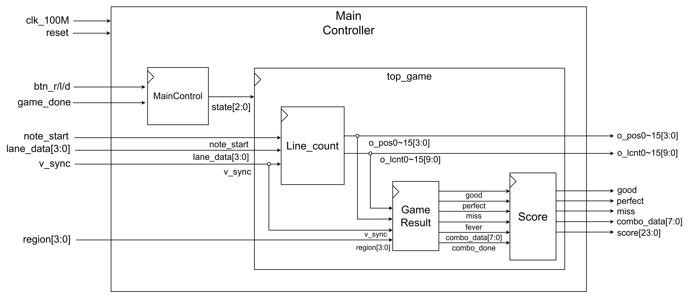

# FPGA-based VGA Rhythm Game

OV7670 카메라로 빨간색 마커의 위치를 검출하고, 
VGA 화면의 노트와 비교하여 게임 판정 및 점수를 계산하는 FPGA 기반 리듬게임입니다.

---

## Demo

[▶ FPGA Rhythm Game 동작 영상](https://github.com/user-attachments/assets/dcfb6514-df86-4189-b6a7-1a21a0237377)

---

## Overview

| 항목 | 내용 |
|:---|:---|
| Language | Verilog, SystemVerilog, Python |
| Development Environment | Vivado 2020.2 |
| FPGA Board | Basys3 |
| Camera | OV7670 |
| Interface | VGA, UART, SCCB |
| Features | Note Control, Region Detection, Game Judgment, Score Calculation |

---

## Contents

- [System Architecture](#system-architecture)
- [UART Receiver](#uart-receiver)
- [Main Controller](#main-controller)
  - [Main Control FSM](#main-control-fsm)
  - [Line Count](#line-count)
  - [Game Result and Score](#game-result-and-score)
- [VGAcam](#vgacam)
  - [Camera Interface](#camera-interface)
  - [Game Processing](#game-processing)
- [UART Sender](#uart-sender)
- [Python Application](#python-application)

---

## System Architecture

1. Python에서 노트의 Lane 정보와 게임 종료 데이터를 UART로 전송
2. UART Receiver에서 Lane 정보를 수신하고 노트 생성 신호 출력
3. Main Controller에서 최대 16개의 노트 데이터를 관리하고 화면의 세로 위치를 이동
4. OV7670 영상의 4개 Lane에서 빨간색 마커 검출
5. 노트가 위치한 Lane과 빨간색 마커가 검출된 Lane을 확인하고, 입력 시점의 노트 위치에 따라 게임 판정
6. 카메라 영상과 게임 화면을 합성하여 VGA로 출력
7. 게임 상태, 판정 결과, Combo 및 점수를 UART로 Python에 전송

---

## UART Receiver

### Block Diagram

- Python에서 전송한 8-bit UART Data 수신
- 하위 4-bit를 Lane Data로 저장하고, 각 Bit를 해당 Lane의 노트 생성 정보로 사용
- 저장된 Lane Data를 `v_sync` Rising Edge에서 `lane_data[3:0]`와 `note_start`로 출력
- 상위 4-bit가 `4'hF`이면 게임 종료 신호로 해석하여 `game_done` 출력
 
## Main Controller

### Block Diagram

- Main Control에서 게임 상태와 음악 선택 정보 관리
- Line Count에서 `lane_data[3:0]`를 저장하고 노트별 Lane과 세로 위치 출력
- GameResult에서 노트의 Lane 정보, 세로 위치 및 `region[3:0]`을 기준으로 게임 판정
- Score에서 판정 결과, Combo 및 Fever 상태를 기준으로 점수 계산

### Main Control FSM

- **IDLE**: 게임 시작 대기
- **SELECT**: 버튼 입력을 통해 음악 선택
- **READY**: 게임 시작 전 3초 대기
- **GAME_CONT**: 게임 진행
- **RESULT**: 게임 결과 출력 및 확인 입력 대기
- **DONE**: 게임 종료 신호 출력 및 재시작 대기

### Line Count

- `note_start` 입력 시 `lane_data[3:0]`를 새로운 노트 데이터로 저장
- 노트별 Lane 정보를 `o_pos0`~`o_pos15`로 관리
- 노트별 세로 위치를 `o_lcnt0`~`o_lcnt15`로 관리
- VGA Frame마다 활성화된 노트의 세로 위치 이동
- 화면을 벗어난 노트 데이터는 초기화

### Game Result and Score

#### GameResult

- 노트가 생성된 Lane인 `o_pos0`~`o_pos15`와 빨간색 마커가 검출된 `region[3:0]`을 비교
- Lane이 일치하면 해당 노트의 `o_lcnt0`~`o_lcnt15` 값에 따라 Perfect 또는 Good 판정
- 판정 영역을 통과할 때까지 일치하는 입력이 없으면 Miss 판정
- 판정 결과를 기준으로 Combo와 Fever 상태 생성

#### Score

- Perfect와 Good 판정에 따라 기본 점수 계산
- Fever 상태에서는 기본 점수를 2배로 적용

## VGAcam

### Block Diagram

### Camera Interface

#### VGA Decoder

- 100 MHz Clock을 기준으로 VGA Pixel Timing 생성
- `HSYNC`, `VSYNC`, `x_pixel`, `y_pixel`, `DE` 출력

#### OV7670 SCCB Controller

- SCCB 통신을 통해 OV7670 초기화 및 레지스터 설정
- 설정 데이터를 순차적으로 전송하여 카메라 동작 환경 구성

#### OV7670 Mem Controller

- OV7670에서 연속으로 수신한 8-bit Pixel Data 2개로 16-bit RGB565 Data 생성
- Frame Buffer에 저장할 Write Address, Data 및 Write Enable 생성

#### Frame Buffer

- 카메라의 RGB565 영상 데이터 저장
- `pclk`에서 데이터를 저장하고 VGA Read Clock에서 데이터 출력

### Game Processing

#### Region Detector

- 카메라 화면을 4개 Lane으로 구분
- 각 Lane의 빨간색 Pixel 수를 기반으로 마커가 위치한 Lane을 판별하고 `region[3:0]`으로 출력

#### Filter Region

- RGB565 Data에서 R/G/B 각 색상의 상위 4-bit를 선택하여 12-bit RGB Data로 사용
- `region[3:0]`을 기준으로 빨간색 마커가 검출된 Lane 표시

#### Filter Note

- `note_x0`~`note_x15`와 `note_y0`~`note_y15`를 기준으로 노트 표시

#### Filter Game

- Lane 구분선과 판정 영역 표시

## UART Sender

### Packet Generator

- 게임 상태, 버튼 입력 또는 판정 결과가 변경되면 UART Packet 생성
- 게임 상태, 판정 결과, Combo 및 24-bit Score를 7-byte Packet으로 구성

| Byte | Data |
|:---|:---|
| 0 | Header (`8'hFF`) |
| 1 | Game State, Button |
| 2 | Fever, Perfect, Good, Miss |
| 3 | Combo |
| 4 | Score `[7:0]` |
| 5 | Score `[15:8]` |
| 6 | Score `[23:16]` |

### FIFO

- Packet Generator에서 생성한 Byte Data 저장
- UART TX 상태에 맞춰 저장된 데이터를 순서대로 출력

### UART TX

- FIFO에서 출력된 8-bit Data를 UART로 전송
- 115,200 bps로 Serial TX 신호 출력

## Python Application

### UART Handler

- 노트의 Lane 정보와 게임 종료 데이터를 UART로 FPGA에 전송
- FPGA에서 전송한 7-byte Packet을 수신하고 게임 정보로 분리

### Game UI

- 음악 재생 시점에 맞춰 노트 데이터 전송
- FPGA에서 수신한 게임 상태, 판정 결과, Combo 및 Score 표시
- 게임 상태에 따라 선택, 진행 및 결과 화면 출력

### Config

- UART Port와 Baud Rate 설정
- 게임 화면 및 음악 관련 설정값 관리
